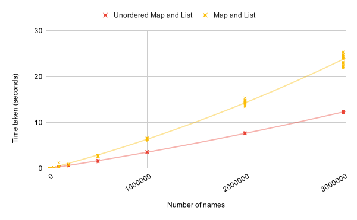

% Advanced Software Engineering Software Development Investigation Report
% Daniel Holland N0697611
 
\pagebreak

## Task 1
### Task 1b
##### Constructor - Always O(1)
```c++
Dictionary();
```
Constant, as an empty dictionary is created, and nothing happens to it except that the pointer to the first node is set to null, which is a constant time operation.

##### Copy Constructor - Always O(n)
```c++
Dictionary(const Dictionary &);
```
As it depends on the size of the dictionary. Each node must be copied, copying a single node is constant time, and this happens for each node, so O(n) overall.


##### Move Constructor - Always O(1)
```c++
Dictionary(Dictionary&&) noexcept;
```
A new empty dictionary is created, the first node pointer of which is pointed to the same node as the first node pointer of the other dictionary, and the first node pointer of the other dictionary is then made null. These operations are constant time, therefore O(1) overall.

##### Destructor - Always O(n)
```c++      
~Dictionary();
```
Each node must be deleted individually, which is affected by the number of nodes and therefore O(n).


##### Insert - Best case O(1), Worst case O(n), Average case O(n)
```c++  
bool insert(Key, Item);
```
Best case is that the key to insert matches the first key, so the item replaces its item, which is O(1). Worst case is key is not in dictionary, so every key checked (which is O(n)) before inserting a new item. Average case will be between inserting at node's average position (half way through, complexity of order O(n)) and key absent (also O(n)), therefore average case O(n).

##### Lookup - Best case O(1), Worst case O(n), Average case O(n)

```c++
Item *lookup(Key);
```
Best case is that the item sought is the first checked, which is O(1). Worst case is key is not or is last in the dictionary, so every key checked (which is O(n)). Average case will be between case for node's average position (half way through, complexity of order O(n)) and item absent/last (also O(n)), therefore average case O(n).

##### Remove - Best case O(1), Worst case O(n), Average case O(n).
```c++  
bool remove(Key);
```

Best case is that the node to remove is the first checked, which is O(1). Worst case is the key is not or is last in the dictionary, so every key checked (which is O(n)). Average case will be between case for node's average position (half way through, complexity of order O(n)) and key absent/last (also O(n)), therefore average case O(n).

##### Remove If - Always O(n)
```c++
int removeIf(Predicate);
```
Every node is always checked, which is O(n). Worst case would be every node is removed aswell, but still O(n) overall as both operations are O(n).


##### Copy Assignment Operator - Always O(n)
```c++
Dictionary & operator=(const Dictionary &);
```
It depends on the size of the dictionaries. Nodes on the copied to dictionary must first all be removed, which is O(n), and then the nodes from the copied from dictionary must be copied over, which is also O(n). Both operations O(n) therefore O(n) overall.
 
 
##### Move Assignment Operator - Always O(1)
```c++
Dictionary & operator=(Dictionary&& other) noexcept;
```
The pointer to the first node of the target must be pointed to the other dictionary's first node, then the other dictionary's first node pointer is made null. Both operations O(1), therefore O(1) overall.

\pagebreak

## Task 2
### Task 2a
#### List
```c++
std::list
```
A doubly-linked list is used to implement `std::list` (Cplusplus.com, 2019). A doubly-linked list consists of nodes, each of which contains a pointer to its successor and predecessor. Pointers to the first and last nodes in the list are stored, and by following the successor and predecessor pointers from these, it is possible to navigate to any node in the list. When a new node is added to the doubly-linked list, the pointers of the nodes immediately before and after the position of this new node are re-pointed to this new node, and this new node's pointers are pointed too its neighbours. If inserting at the start or end of the list, only the first or last node must have its pointers adjusted.

##### Insertion
List has three insertion functions, all of guaranteed time complexity O(1): `std::list::insert`, `std::list::push_front`, and `std::list::push_back`. However, `insert` requires an iterator, and moving this iterator to a position in the list from the front or back is only guaranteed to be O(n) time complexity operation (Best case O(1), average case O(n): see following paragraph for explanation of time complexity of list searching). `push_front` and `push_back` (which are just insertions at the front/back) are both always O(1) because the doubly-linked list always stores the first and last position, so these positions can be accessed in constant time.

##### Search
The `std::find_if` function can be passed the start and end iterators of a list, and a predicate, to find the first item in the list which satisfies the predicate. As the list items would be pairs of strings (if used to store the initial pairs of names), the predicate would need to check whether the sought key is equal to either the first or second item (depending on whether going east or west). The guaranteed time complexity of `std::find_if` is O(n), the average case is O(n), and the best case is O(1). The best case is O(1) because if the sought item is the first checked, then it is returned in constant time. The average case is O(n) because the average will be at least the time to pass through half the list (O(n)), and at most the time to pass through the whole list (O(n)). The guaranteed time complexity is O(n), as this is the complexity for the worst case possible, the traversal of the entire list item by item every time a search is made.

#### Map
```c++
std::map
```
A self-balancing binary search tree is typically used to implement `std::map` (Cplusplus.com, 2019). A binary search tree, like a doubly linked list, consists of nodes, each with two pointers. However, it differs from a doubly-linked list in the structure created using these nodes. The binary search tree's nodes have a left and right pointer, which is either a `nullptr`, representing a leaf of the tree, or a pointer to another node. The left child's key is always smaller, and the right child's key is always larger, when compared to the key of the node. A self-balancing tree keeps the time complexity of operations on the tree low by preventing some branches getting considerably longer than others. This keeps the height of the tree as low as (or almost as low as) possible for the number of nodes. The tree self-balances by using an algorithm like the AVL or Red-Black Tree methods.

##### Insertion
Map has two equivalent insertion functions, `std::map::insert` and `std::map::operator[]`. Both have time complexity guarantees of O(log₂ n) (Riesbeck, C. n.d.). This is the case because insertion into a self-balancing binary search tree requires traversal to the bottom of the tree, and the height of the tree for a given number of nodes n is log₂ n (as the number of new nodes doubles with each level added to height, as each node may have two children). 

 
##### Search
If a key is known to be present in a map, `std::map::operator[]` can be used to return a reference to it (this will otherwise create a new element with the key). If it is unknown whether the key exists, `std::map::find` may be used to search for it. Both have time complexity guarantees of O(log₂ n). A self-balancing binary tree allows for this guarantee because even if the sought node is at the very bottom of the tree, the number of nodes which must be traversed still only scales with log₂, for the same reason given for insertion above. Search has a better best case time complexity however, as it is possible that the sought node is the root node, in which case the time complexity will be O(1), as it is the first node checked every time. The average case is O(log₂ n) because the average will be at least the time to check half the nodes (still O(log₂ n), as the majority of the nodes are on the last two levels anyway), and at most the time to check all the nodes (O(log₂ n)).

#### Unordered Map
```c++
std::unordered_map
```
A hash-table is typically used to implement an unordered map (GeeksforGeeks, 2017). A hash-table is a randomly accessible data structure, which stores items in buckets (which are likely linked lists themselves) spread across a contiguous block of memory. Items are stored in buckets based on the their hash-codes (with the index being the hash-code modulus the number of buckets). When the hash-table becomes too full, a new area of memory, double the size of the previous, is allocated, and all the current items are copied across, being re-hashed based on the new size. This keeps the number of items per bucket (the load factor) low.

##### Insertion
Like map, unordered map has two equivalent insertion functions, `std::unordered_map::insert` and `std::unordered_map::operator[]`. However, for unordered map, these functions have a best case time complexity of O(1), an average time complexity of O(1), and a worst case time complexity of O(n). In the best case, the item is inserted directly into a position based on its hash-code. In the worst case, the hash-table is too full, and must be completely copied and re-hashed. Because the worst case occurs infrequently relative to the best case, the time complexity over a series of insertions amortises to an average of O(1) (www.cs.cornell.edu, n.d.).

##### Search
Again like map, unordered_map has two search functions `std::unordered_map::operator[]` can be used to return a reference to a key already present in a map (this will otherwise create a new element with the key). If it is unknown whether the key exists, `std::unordered_map::find` may be used to search for it. Like insertion into an unordered_map, these functions have a best case time complexity of O(1), an average time complexity of O(1), and a worst case time complexity of O(n). The worst case is if all the items are in one bucket, and they must all be iterated through to find the sought item. A more effective hashing function will cause inserted items to be spread more evenly between buckets. Combined with resizing when the load factor is too high (to reduce load factor), this keeps the time-complexity of searches down by ensuring that buckets do not contain too many items.


### Task 2b
Two data structures are necessary: the first well suited to searching for records, the second well suited to the insertion of records at the front and back. Two instances of the first structure will be necessary: one with the western name as the key, one with the eastern name as the key; but only one instance of the second data structure will be needed.

#### Combination 1 - `map` for the first data structure, `list` for the second. 

The items must be inserted into and then searched for in the first data structure. `map` has a guaranteed time complexity of O(log₂ n) for both inserts and searches. The second data structure only requires that items are inserted at the front and back, before the whole sequence is iterated through once at the end to output the final order. `list` has a time complexity of O(1) to insert at the front and back, making it well suited to this task.  
The algorithm requires the insertion of all elements into the maps (O(n log₂ n)), the retrieval by search of the elements from these maps (O(n log₂ n)), then the insertion of all elements into the list at either the front or back (O(n)). The greatest of these is O(n log₂ n), therefore the time complexity of the algorithm is O(n log₂ n) overall. 

##### Space usage + Explanation
`map` is more memory efficient than `unordered_map`, because Binary Search Trees only ...

#### Combination 2 - `unordered_map` for the first data structure, `list` for the second.

For inserting, `unordered_map` has an amortised time complexity of O(1). For searching, it will have a typical time complexity of O(1). A bad hash function would result in a worse search time complexity, but `std::string` will be used for the key, and the hash function for this can be safely assumed to be compliant with the Cpp17Hash requirements from the C++ International Standard. As stated above, `list` has a time complexity of O(1) for an insertion at the front or back.

Insertion of all the elements into the maps is O(n), the retrieval of the elements is O(n), and the insertion of these elements is O(n). Therefore the time complexity of the algorithm is O(n) overall.

##### Space usage + Explanation
Because ...

#### Choice - `unordered_map` for the first data structure, `list` for the second
The overall time complexity of the algorithm with this combination of data structures is O(n), whereas using `map` in place of `unordered_map` would have a time complexity of O(n log n). For the second structure, `list` is appropriate because it is efficient (guaranteed time complexity O(1)) to add items at its front and back, and the algorithm requires that items are added first at one end, then at the other.

##### Space Usage

\pagebreak
## Task 3

### Task 3b




\pagebreak
## Task 4

### Task 4a

### Task 4c


\pagebreak
## References

 www.cs.cornell.edu. (n.d.). Lecture 22: Hash tables and amortized analysis. [online] Available at: [http://www.cs.cornell.edu/courses/cs3110/2008fa/lectures/lec22_amort.html](http://www.cs.cornell.edu/courses/cs3110/2008fa/lectures/lec22_amort.html) [Accessed 22 Feb. 2020].


C++ International Standard https://isocpp.org/

Cplusplus.com. (2019). Reference - C++ Reference. [online] Available at: [http://www.cplusplus.com/reference/](http://www.cplusplus.com/reference/).


John Ahlgren: STL Container Performance (2013). [online] John Ahlgren. Available at: [http://john-ahlgren.blogspot.com/2013/10/stl-container-performance.html](http://john-ahlgren.blogspot.com/2013/10/stl-container-performance.html).

GeeksforGeeks. (2017). map vs unordered_map in C++. [online] Available at: [https://www.geeksforgeeks.org/map-vs-unordered_map-c/](https://www.geeksforgeeks.org/map-vs-unordered_map-c/) [Accessed 20 Feb. 2020].


\pagebreak
## Bibliography

Riesbeck, C. (n.d.) EECS 311: STL Containers. [online] users.cs.northwestern.edu. Available at: [https://users.cs.northwestern.edu/~riesbeck/programming/c++/stl-summary.html](https://users.cs.northwestern.edu/~riesbeck/programming/c++/stl-summary.html) [Accessed 20 Feb. 2020].

\pagebreak
## Appendices
### Appendix A


### Appendix B

#### Serial Algorithm


\pagebreak
#### Non-Serial Algorithm using Map


#### Non-Serial Algorithm using Unordered Map

